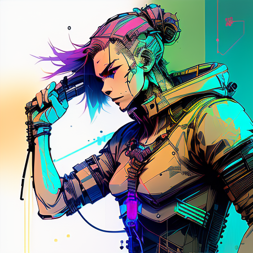
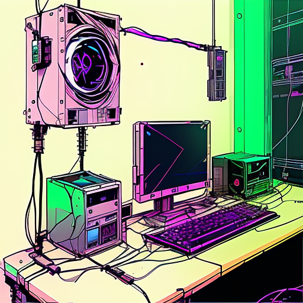
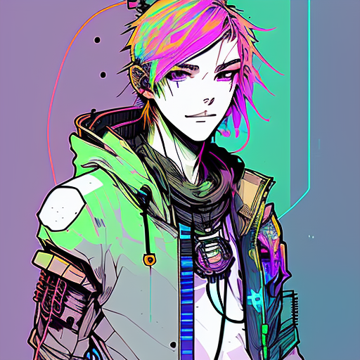
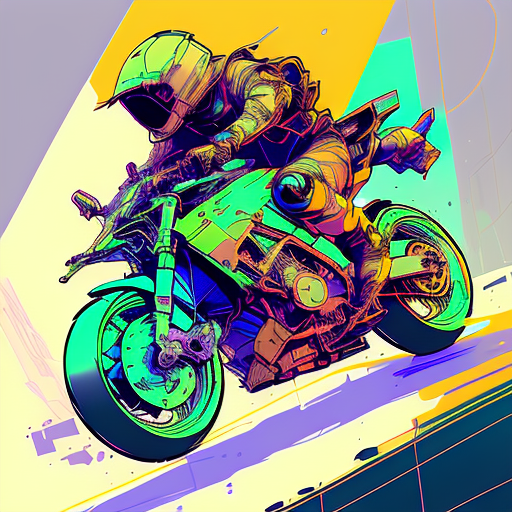

## Inkpunk Diffusion (PyTorch)

A from-scratch, modular PyTorch re-implementation of an Inkpunk-style Stable Diffusion v1.5 pipeline. I built this to demonstrate hands-on expertise with diffusion models, attention-based UNet **architectures**, CLIP text encoding, and VAE image compression — with clean, readable code and reproducible results across CUDA, Apple Silicon (MPS), and CPU.

### What this project demonstrates

- End-to-end diffusion pipeline: CLIP tokenizer/encoder → UNet denoiser → VAE decode
- Weight compatibility: load SD-compatible checkpoints (e.g., Inkpunk) into custom modules
- Deterministic, reproducible generation via seed control and fixed samplers
- Practical engineering: device auto-detection, modular design, and simple CLI

### Tech stack

- Python, PyTorch, PIL
- Hugging Face `transformers` (CLIPTokenizer)
- CUDA / Apple Metal (MPS) / CPU

---

## Results Gallery (Inkpunk style)

Below are sample generations produced by the codebase using curated Inkpunk prompts. Each image is reproducible with the listed prompt and seed.




Prompt (positive):
> nvinkpunk cyberpunk samurai with neon mask, glowing swords, graffiti wall background, rainbow smoke, vibrant spray paint textures, ultra detailed

Negative prompt:
> flat shading, sticker-like outline, deformed fins, bland palette



Prompt (positive):
> nvinkpunk hacker shrine, floating keyboards, rainbow cables, CRT glow, graffiti calligraphy, ultra detailed

Negative prompt:
> generic UI overlays, unreadable text blocks, banding, chromatic noise



Prompt (positive):
> nvinkpunk neon jellyfish city, bioluminescent tendrils, rainbow mist, aerosol dots, ultra detailed

Negative prompt:
> duplicated tendrils, watery blur, plastic look, low contrast



Prompt (positive):
> nvinkpunk desert racer hoverbike, sand neon trail, rainbow heat haze, graffiti decals, cinematic, ultra detailed

Negative prompt:
> soft focus, mushy edges, duplicated handlebars, warped geometry

To add more results, generate with your preferred prompts (see Reproduce My Results) and place the images under `outputs/`. Then embed them here in the same way.

---

## Quickstart

1. Navigate to the project root:
    ```bash
    cd Stable_diffusion
    ```

2. Install dependencies:
    ```bash
    pip install -r requirements.txt
    ```

3. Weights
    - This project expects `assets/Inkpunk-Diffusion-v2.ckpt` to be present (already included in my setup).
    - If you need to fetch base SD 1.5 weights for experimentation, configure your Hugging Face token and use the helper script:
      ```bash
      # optional
      # cp .env.example .env
      # python download_weights.py
      ```

4. Run the interactive app:
    ```bash
    python main.py
    ```

---

## Reproduce My Results

### Interactive (recommended)
- Run `python main.py` and select “Text-to-Image Generation”.
- Pick a built-in Inkpunk prompt or enter your own. Use seed `42` to match my gallery.

### Programmatic usage
```python
from transformers import CLIPTokenizer
from src.models.model_loader import preload_models_from_standard_weights
from src.pipeline import generate

device = "cuda"  # or "mps", "cpu"
tokenizer = CLIPTokenizer(
    "assets/tokenizer/vocab.json",
    merges_file="assets/tokenizer/merges.txt"
)

models = preload_models_from_standard_weights(
    "assets/Inkpunk-Diffusion-v2.ckpt", device
)

image = generate(
    prompt=(
        "nvinkpunk neon taxi drifting in rain, chrome reflections, "
        "rainbow streaks, street tags, cinematic, ultra detailed"
    ),
    uncond_prompt=(
        "warped wheels, melted chrome, motion smear, muddy puddles"
    ),
    models=models,
    device=device,
    tokenizer=tokenizer,
    seed=42,
    do_cfg=True,
    cfg_scale=9.0,
    sampler_name="ddpm",
    n_inference_steps=80,
)
# Save to outputs/ using your preferred filename
```

Example additional curated prompts (InkPunk style):
- `nvinkpunk cyber koi swirling in midair, holographic water, rainbow reflections, ink splatter, ultra detailed`  
  Negative: `flat shading, sticker-like outline, deformed fins, bland palette`
- `nvinkpunk hacker shrine, floating keyboards, rainbow cables, CRT glow, graffiti calligraphy, ultra detailed`  
  Negative: `generic UI overlays, unreadable text blocks, banding, chromatic noise`

---

## Architecture Overview

- VAE: Variational Autoencoder for latent-space image compression and decoding
- CLIP: Text encoder (tokenization + embeddings) for prompt conditioning
- UNet: Denoising network with self- and cross-attention blocks
- DDPM sampler: Iterative denoising loop (configurable steps and guidance scale)

All components are implemented in PyTorch with a clean, modular design for readability and extension.

---

## Project **Structure**

```
Stable_diffusion/
├── src/
│   ├── models/
│   │   ├── attention.py      # Self & cross-attention
│   │   ├── vae.py            # VAE encoder & decoder
│   │   ├── clip.py           # CLIP text encoder
│   │   ├── unet.py           # UNet denoiser
│   │   ├── diffusion.py      # Diffusion loop & DDPM sampler
│   │   └── model_loader.py   # Load/convert SD-compatible weights
│   └── pipeline.py           # Orchestration for generation
├── assets/
│   └── Inkpunk-Diffusion-v2.ckpt
├── main.py                   # Interactive CLI
├── download_weights.py       # Optional weights helper
├── requirements.txt          # Dependencies
└── README.md
```

---

## License

This repository is for educational and portfolio purposes. The Inkpunk Diffusion model weights are governed by their original license. Base Stable Diffusion weights are governed by Stability AI’s license.

---

## Troubleshooting

- Memory constraints: lower `n_inference_steps` or image size; prefer GPU/MPS when available
- Import/runtime errors: ensure dependencies are installed via `pip install -r requirements.txt`
